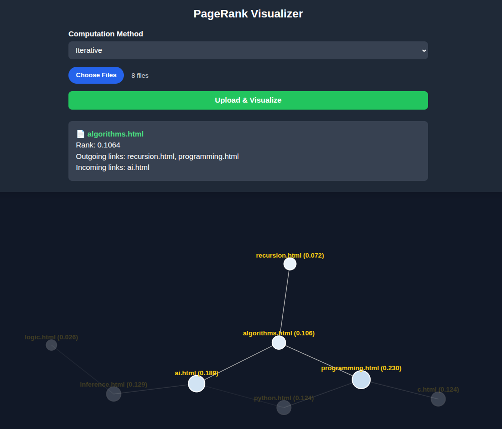

# 📊 PageRank Visualizer (Ver 1.0)

  
  
  


An interactive **PageRank Visualizer** that lets you upload HTML files, compute PageRank using **Iterative** or **Sampling** methods, and explore results in a beautiful **D3.js graph**.  

---

## 🚀 Overview
The project demonstrates how **PageRank** works by analyzing interlinked HTML files. Users can:  
- Upload multiple `.html` files.  
- Choose computation method: **Iterative** (convergence) or **Sampling** (random walk).  
- Explore results in an interactive, resizable graph.  
- Click on nodes to view detailed incoming/outgoing link info.  

---
## 🧠 How PageRank Works
Page-Rank algorithm determines the importance of a webpage of how important it is based on the number of links it has from other important webpages, and it takes less into a/c other less important pages.
It considers the **Random Surfer Model** which simulates a hypothetical surfer on the internet which randomly clicks a link.
There are 2 main strategies for calculating PageRank:

1. **Random Surfer Model**
2.  **Iterative Algorithm**


## ✨ Features
- 🔹 **Two computation methods**: Iterative & Sampling.  
- 🔹 **Interactive D3.js Graph**:  
  - Node size ∝ PageRank value.  
  - Node color intensity = higher rank.  
  - Click nodes to highlight connected pages.  
- 🔹 **Responsive UI** built with TailwindCSS.  
- 🔹 **Fast backend** using Flask + Python.  

---


## 🖼️ Screenshots

  
- Visual Example of graph visualization  
- Node detail layer activated when clicked upon showing the **PageRank Value**, **Outgoing links**, and the **incoming links** the node(page) has. 
---

## ⚙️ Installation

```bash
# Clone repository
git clone https://github.com/GamerBoi801/PageRank-Visualizer
cd pagerank-visualizer

# Create a virtual environment (recommended for Linux)
python -m venv venv
source venv/bin/activate   # On Linux/macOS
venv\Scripts\activate      # On Windows

# Install dependencies
pip install -r requirements.txt
